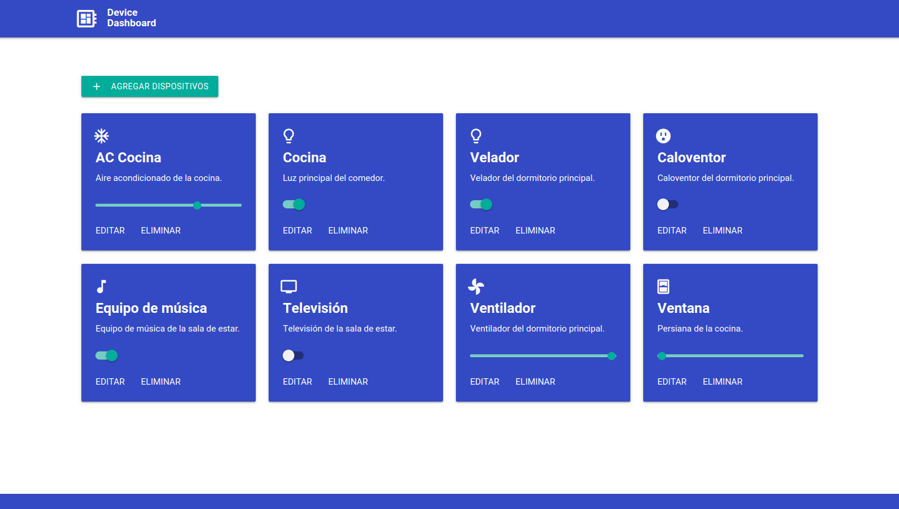

<p align="center">
    <a href="https://www.gotoiot.com/">
        
    </a>
    <h2 align="center">Web App Full Stack Base</h2>
    <p align="center">
        Una aplicación full stack base para desarrollar proyectos IoT
        <br>
        <i>por Agustin Bassi - 2021</i>
    </p>
    <p align="center">
        <a href="https://github.com/gotoiot/app-fullstack-base/graphs/contributors">
            
        </a>
        <a href="https://github.com/gotoiot/app-fullstack-base/network/members">
            
        </a>
        <a href="https://github.com/gotoiot/app-fullstack-base/stargazers">
            
        </a>
        <a href="https://github.com/gotoiot/app-fullstack-base/issues">
            
        </a>
        <a href="https://github.com/gotoiot/app-fullstack-base/blob/master/LICENSE.txt">
            
        </a>
    </p>
</p>

:star: Nos ayudarías mucho apoyando a este proyecto con una estrella en Github!

## Tabla de contenidos

* [Introducción](#introducción)
* [Detalles principales](#detalles-principales)
* [Instalar dependencias](#instalar-dependencias)
* [Descargar el código](#descargar-el-código)
* [Ejecutar la aplicación](#ejecutar-la-aplicación)
* [Detalles de implementación](#detalles-de-implementación)
* [Licencia](#licencia)

## Introducción

Este proyecto es una aplicación web fullstack que se ejecuta sobre el ecosistema `Docker`. Está compuesta por un servicio en `NodeJS` que te permite ejecutar código en backend y al mismo tiempo disponibilizar un `cliente web` para interactar con el servicio. Además tiene una `base de datos` MySQL que puede interactuar con el backend para guardar y consultar datos, y de manera adicional trae un `administrador` de base de datos para poder administrar la base en caso que lo necesites.

La aplicación IoT de base que viene con este proyecto se encarga de crear una tabla llamada `Devices` en la base de datos, y la idea es que vos puedas desarrollar el código de backend y frontend que te permita controlar desde el navegador el estado de los devices - *como pueden ser luces, TVs, ventiladores, persiandas, enchufes y otros* - de un hogar inteligente y almacenar los estados en la base de datos. 

Realizando estas tareas vas a a tener una aplicación fullstack IoT del mundo real que utiliza tecnologías actuales en la que un backend es capaz de interactuar con una DB para cumplir con las peticiones de control que se le mandan desde el cliente web.

En esta imagen podés ver una posible implementación del cliente web que controla los artefactos del hogar.



## Detalles principales

Conociendo las generalidades del proyecto ya podes ver detalles más específicos.

<details><summary><b>Mira los detalles del proyecto</b></summary>
<br>

#### `Arquitectura de la aplicación`

Como ya pudiste ver, la aplicación se ejecuta sobre el ecosistema Docker, y en esta imagen podés ver el diagrama de arquitectura.


#### `El cliente web`

El cliente web es una Single Page Application que se comunica con el servicio en NodeJS mediante JSON a través de requests HTTP. Puede consultar el estado de dispositivos en la base de datos (por medio del servicio en NodeJS) y también cambiar el estado de los mismos. Los estilos del código están basados en **Material Design**.

#### `El servicio web`

El servicio en **NodeJS** posee distintos endpoints para comunicarse con el cliente web mediante requests HTTP enviando **JSON** en cada transacción. Procesando estos requests es capaz de comunicarse con la base de datos para consultar y controlar el estado de los dispositivos, y devolverle una respuesta al cliente web también en formato JSON. Así mismo el servicio es capaz de servir el código del cliente web.

#### `La base de datos`

La base de datos se comunica con el servicio de NodeJS y permite almacenar el estado de los dispositivos en la tabla **Devices**. Ejecuta un motor **MySQL versión 5.7** y permite que la comunicación con sus clientes pueda realizarse usando usuario y contraseña en texto plano. En versiones posteriores es necesario brindar claves de acceso, por este motivo la versión 5.7 es bastante utilizada para fases de desarrollo.

#### `El administrador de la DB`

Para esta aplicación se usa **PHPMyAdmin**, que es un administrador de base de datos web muy utilizado y que podés utilizar en caso que quieras realizar operaciones con la base, como crear tablas, modificar columnas, hacer consultas y otras cosas más.

#### `Ejecución de servicios`

Los servicios de la aplicación se ejecutan sobre **contenedores de Docker**, así se pueden desplegar de igual manera en diferentes plataformas. Los detalles sobre cómo funcionan los servicios los podés ver directamente en el archivo **docker-compose.yml**.

#### `Organización del proyecto`

En la siguiente ilustración podés ver cómo está organizado el proyecto para que tengas en claro qué cosas hay en cada lugar.

```sh
├── db                          # directorio de la DB
│   ├── data                    # estructura y datos de la DB
│   └── dumps                   # directorio de estructuras de la DB
│       └── smart_home.sql      # estructura con la base de datos "smart_home"
├── doc                         # documentacion general del proyecto
└── src                         # directorio codigo fuente
│   ├── backend                 # directorio para el backend de la aplicacion
│   │   ├── index.js            # codigo principal del backend
│   │   ├── mysql-connector.js  # codigo de conexion a la base de datos
│   │   ├── package.json        # configuracion de proyecto NodeJS
│   │   └── package-lock.json   # configuracion de proyecto NodeJS
│   └── frontend                # directorio para el frontend de la aplicacion
│       ├── css                 # donde alojar los estilos de la aplicación
│       ├── images              # donde se deben cargar las imágenes a mostrar en la app web
│       ├── js                  # codigo javascript que se va a desarrollar
│       └── index.html          # archivo principal del cliente HTML
├── docker-compose.yml          # archivo donde se aloja la configuracion completa
├── README.md                   # este archivo
├── CHANGELOG.md                # archivo para guardar los cambios del proyecto
├── LICENSE.md                  # licencia
```

> No olvides ir poniendo tus cambios en el archivo `CHANGELOG.md` a medida que avanzas en el proyecto.

</details>

## Instalar dependencias

Para correr este proyecto es necesario que instales `Docker` y `Docker Compose`. 

<details><summary><b>Mira las instrucciones de instalación</b></summary>
<br>

En [este artículo](https://www.gotoiot.com/pages/articles/docker_installation_linux/) publicado en nuestra web están los detalles para instalar Docker y Docker Compose en una máquina Linux. Si querés instalar ambas herramientas en una Raspberry Pi podés seguir [este artículo](https://www.gotoiot.com/pages/articles/rpi_docker_installation) de nuestra web que te muestra todos los pasos necesarios.

En caso que quieras instalar las herramientas en otra plataforma o tengas algún incoveniente, podes leer la documentación oficial de [Docker](https://docs.docker.com/get-docker/) y también la de [Docker Compose](https://docs.docker.com/compose/install/).

Continua con la descarga del código cuando tengas las dependencias instaladas y funcionando.

</details>

## Descargar el código

Para descargar el código, lo más conveniente es que realices un `fork` de este proyecto a tu cuenta personal haciendo click en [este link](https://github.com/gotoiot/app-fullstack-base/fork). Una vez que ya tengas el fork a tu cuenta, descargalo con este comando (acordate de poner tu usuario en el link):

```
git clone https://github.com/USER/app-fullstack-base.git
```

Abrí la carpeta del proyecto desde VS Code cuando descargues el código.

> En caso que no tengas una cuenta en Github podes clonar directamente este repo.

## Ejecutar la aplicación

Para ejecutar la aplicación tenes que correr el comando `docker-compose up` desde la raíz del proyecto. Este comando va a descargar las imágenes de Docker de node, de la base datos y del admin de la DB, y luego ponerlas en funcionamiento. 

Para acceder al cliente web ingresa a a la URL [http://localhost:8000/](http://localhost:8000/) y para acceder al admin de la DB accedé a [localhost:8001/](http://localhost:8001/). En el login del administrador, el usuario para acceder a la db es `root` y contraseña es la variable `MYSQL_ROOT_PASSWORD` del archivo `docker-compose.yml`.

Si pudiste acceder al cliente web y al administrador significa que la aplicación se encuentra corriendo bien. Los detalles de funcionamiento específico de la aplicación los podés ver en la siguiente sección.

> Si te aparece un error la primera vez que corres la app, deteńe el proceso y volvé a iniciarla. Es debido a que el backend espera que la base esté creada al iniciar, y en la primera ejecución puede no alcanzar a crearse, a partir de la segunda vez ya se soluciona el problema.

## Detalles de implementación

En esta sección podés ver los detalles específicos de funcionamiento del código y que son los siguientes.

<details><summary><b>Mira los detalles de implementación</b></summary>
<br>

#### `Agregar un dispositivo`

Completá los pasos para agregar un dispositivo desde el cliente web.

#### `Frontend`

Completá todos los detalles sobre cómo armaste el frontend, sus interacciones, etc.

#### `Backend`

Completá todos los detalles de funcionamiento sobre el backend, sus interacciones con el cliente web, la base de datos, etc.

**Endpoints**

Completá todos los endpoints del backend con los metodos disponibles, los headers y body que recibe, lo que devuelve, ejemplos, etc.

1) Devolver el estado de los dispositivos.

```json
{
    "method": "get",
    "request_headers": "application/json",
    "request_body": "",
    "response_code": 200,
    "request_body": {
        "devices": [
            {
                "id": 1,
                "status": true,
                "description": "Kitchen light"
            }
        ]
    },
}
``` 

</details>

## Colaborar

¿Te gustó el proyecto? Si es así no dudes en apoyarlo con una :star: en Github desde [la home del proyecto](https://github.com/gotoiot/app-fullstack-base), esto motiva mucho a seguir adelante con el desarrollo de código para la comunidad. Si estás interesado en recibir novedades cuando se hagan actualizaciones, podes suscribirte desde [este link](https://github.com/gotoiot/app-fullstack-base/subscription).

Si te gustaría aplicar mejoras a este proyecto podes abrir un hilo de discusión en [este link](https://github.com/gotoiot/app-fullstack-base/issues/new) para conversarlas y luego podrías enviarlas mediante un `pull request`. 

Finalmente podés compartir este proyecto para que más personas puedan utilizarlo y beneficiarse de esta gran comunidad del software libre.

## Licencia

[MIT](https://choosealicense.com/licenses/mit/)

## Acerca de Goto IoT

Estos son los links más relevantes para que puedas mantenerte al tanto de novedades y actualizaciones :point_down:

* **[Sitio web](https://www.gotoiot.com/):** Donde se publican los artículos y proyectos sobre IoT. 
* **[Github de Goto IoT:](https://github.com/gotoiot)** Donde están todos los proyectos para descargar y utilizar. 
* **[Foro de Goto IoT:](https://groups.google.com/g/gotoiot)** Donde los miembros del grupo realizan consultas técnicas, solucionan problemas y comparten novedades.
* **[Twitter de Goto IoT:](https://twitter.com/gotoiot)** Donde se publican novedades como nuevos proyectos y artículos, así como también temas relacionados con la materia.
* **[Wiki de Goto IoT:](https://github.com/gotoiot/doc/wiki)** Donde hay información complementaria de desarrollo que puede ser de utilidad para ampliar el contexto.


