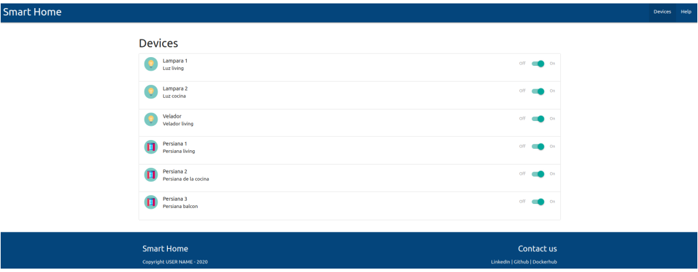

# DAW Project Template

<table>
  <tr>
   <td><strong>Authors</strong></td>
   <td>Agustin Bassi - Brian Ducca - Santiago Germino</td>
  </tr>
  <tr>
   <td><strong>Year</strong></td>
   <td>2020</td>
  </tr>
  <tr>
  <tr>
   <td><strong>Licence</strong></td>
   <td>GPLV3+</td>
  </tr>
  <tr>
  <tr>
   <td><strong>Details</strong></td>
   <td>Proyecto de base para Desarrollo de Aplicaciones Web</td>
  </tr>
  <tr>
  <tr>
</table>

## Tabla de contenidos

* [Introducción](#introducción)
* [Docker y Docker Compose](#docker-y-docker-compose)
* [Fork del repositorio en GitHub](#fork-del-repositorio-en-github)
* [Descargar el fork](#probar-la-aplicacion)
* [Levantar servicios](#compilar-de-typescript-a-javascript)
* [Prueba de los servicios](#detalles-de-implementacion-del-proyecto)
* [Compilador de Typescript](#detalles-de-implementacion-del-proyecto)
* [Organización del proyecto](#detalles-de-implementacion-del-proyecto)
* [Base de datos](#detalles-de-implementacion-del-proyecto)
* [Licencia](#licencia)

## Introducción

Este repositorio de GitHub sirve como base para todas las clases del curso **Desarrollo de Aplicaciones Web** de la Carrera de Especialización en IoT de la FI-UBA. 

El trabajo de la cursada se realizará sobre una copia de este repositorio en la cuenta personal de GitHub del alumno. En cada clase, el alumno actualizará su propio repositorio con las prácticas realizadas.

De manera incremental, se comenzará la cursada con un entorno que dispone de las herramientas necesarias y la estructura vacia de una aplicación web. Se irá trabajando clase a clase en diferentes aspectos de dicha aplicación. Al finalizar la cursada, el alumno contará con una aplicación web desarrollada.

En la siguiente figura se observa un diagrama general de las herramientas utilizadas durante el dictado del curso:


Las herramientas no se instalarán una a una de manera individual, sino que se ofrecen listas para usar. A tal fin se encuentran encapsuladas en contenedores [Docker](https://es.wikipedia.org/wiki/Docker_(software)). La interoperabilidad entre contenedores se logra mediante el uso de la herramienta [Docker Compose](https://docs.docker.com/compose/).

El [navegador o cliente web](https://es.wikipedia.org/wiki/Navegador_web) se comunica con el servicio web ejecutado en un servidor [Node.js](https://es.wikipedia.org/wiki/Node.js) mediante el envío de requests [HTTP](https://es.wikipedia.org/wiki/Protocolo_de_transferencia_de_hipertexto). Una vez establecida la conexión y realizado el intercambio de datos, el navegador presenta la aplicación web (en este ejemplo, un panel de control de domótica para el hogar) como se observa en la siguiente figura:



A continuación se listan los pasos para obtener el material requerido por la cursada.

## Docker y Docker Compose
Se deberán instalar las herramientas **Docker** y **Docker Compose**. Las mismas son gratuitas y estan disponibles para su instalación en varios sistemas operativos.

* Docker (Pasos de instalación en la [documentacion oficial](https://docs.docker.com/get-docker/)).
* Docker Compose (Pasos de instalacion en la [documentacion oficial](https://docs.docker.com/get-docker/)).

## Fork del repositorio en GitHub

Se deberá realizar una [bifurcación o fork](https://es.wikipedia.org/wiki/Bifurcaci%C3%B3n_(desarrollo_de_software)), en la cuenta personal de GitHub de cada alumno, del repositorio del curso. Para esto tomar como base los siguientes pasos:

1. Entrar a GitHub con la cuenta personal del alumno.
2. Ir al repositorio oficial del curso en [https://github.com/ernesto-g/daw](https://github.com/ernesto-g/daw) 
3. En la esquina superior derecha de la pantalla se muestra un botón llamado "Fork". Presionarlo para iniciar el proceso de copia.
4. GitHub consultará "En donde realizar el fork", responder con un click en la cuenta personal del alumno.
5. Ponerle el nombre `daw-project` borrando la palabra `template` **(no logré reproducir esto al momento de forkear.. es necesario ir a la configuración de repos propios en GitHub? de ser así, sería bueno indicar los pasos a seguir)**

## Descargar el fork

Para descargar el repositorio desde la cuenta personal del alumno, ejecutar los siguientes comandos en una terminal de linux. Notar que se debe reemplazar la palabra "USUARIO" por el nombre de la cuenta del alumno en GitHub.

```
git clone https://github.com/USUARIO/daw-project.git
cd daw-project/
```

## Levantar servicios

Los servicios de las herramientas utilizadas deben iniciarse mediante un comando ejecutado en una terminal de linux y dentro de la carpeta "daw-project". Continuando desde las instrucciones anteriores, el comando es el siguiente:

```
docker-compose up
```

Los servicios que se desplegarán son los siguientes:

* compilador de Typescript
* motor Node.js 10
* base de datos MySQL 5.7
* administrador de base de datos PHPMyAdmin.

Para detener estos servicios, presionar `CTRL+C` en la terminal desde donde se iniciaron.

## Prueba de los servicios

Para probar el correcto funcionamiento de los servicios básicos sobre los que correrá la futura aplicación web, visitar las siguientes direcciones locales desde un navegador web:

* [http://localhost:8000/](http://localhost:8000/) visualiza la aplicación servida por Node.js. 
* [http://localhost:8001/](http://localhost:8001/) se accede al administrador de bases de datos PHPMyAdmin.

_Para acceder a la base de datos MySQL desde PHPMyAdmin se deberá ingresar el usuario y contraseña de la misma tal como figuran en el archivo `docker-compose.yml`_

## Compilador de Typescript

El servicio de compilación de Typescript se utiliza en la fase de desarrollo del proyecto. El objetivo de compilar Typescript es generar código Javascript para ser servido por Node.js.

El codigo Typescript a compilar se toma desde la carpeta `src/front/ts` y el codigo compilado en Javascript se almacena en `src/front/js`. Se deberá compilar toda vez que el código Typescript cambie. De no hacerlo, **Node.js continuará sirviendo una versión anterior**. Para compilar, ejecutar el siguiente comando:

```
docker-compose up ts-compiler
```

Presionar `CTRL+C` si se desea detener una compilación en progreso.

## Organización del proyecto

Se decidió utilizar la siguiente estructura de directorios y archivos para alojar los servicios en Docker y el código de la aplicación web. En la siguiente ilustración se observa dicha estructura y la descripción de cada elemento contenido en la misma.

```sh
├── db                          # directorio de la DB
│   ├── data                    # estructura y datos de la DB
│   └── dumps                   # directorio de estructuras de la DB
│       └── smart_home.sql      # estructura con la base de datos "smart_home"
├── doc                         # documentacion general del proyecto
└── src                         # directorio codigo fuente
│   ├── back                    # directorio para el backend de la aplicacion
│   │   ├── index.js            # codigo principal del backend
│   │   ├── mysql-connector.js  # codigo de conexion a la base de datos
│   │   ├── package.json        # configuracion de proyecto NodeJS
│   │   └── package-lock.json   # configuracion de proyecto NodeJS
│   └── front                   # directorio para el frontend de la aplicacion
│       ├── index.html          # archivo principal del cliente HTML
│       ├── js                  # codigo javascript (compilado con compilador TS)
│       ├── static              # archivos que no cambian (imagenes, CSS, fuentes)
│       └── ts                  # codigo typescript (a compilar)
├── docker-compose.yml          # archivo donde se aloja la configuracion completa
├── README.md                   # este archivo
├── CHANGELOG.md                # archivo para guardar los cambios del proyecto
├── LICENSE.md                  # licencia
```

En el archivo `CHANGELOG.md` se deberá completar el historial de cambios del proyecto.

## Base de datos

El servidor de base de datos es MySQL versión 5.7. Se utiliza esta versión ya que permite un ingreso simple a la base de datos mediante usuario y password. Para realizar un cambio de usuario o de password se debe modificar la configuracion en el archivo `docker-compose.yml`.

Toda vez que se levanta el servicio de base de datos, mediante la configuración **(cual?)** se indica que deberán ejecutarse los comandos SQL contenidos en el archivo `db/dumps/smart_home.sql`. Estos comandos crean la estructura de la base de datos de la aplicación web a desarrollar. 

Se utiliza este mecanismo a fin de iniciar la base de datos por única vez, ya que los comandos SQL allí contenidos no afectan el contenido de una base de datos ya iniciada.

## Licencia

Este proyecto es publicado bajo licencia GPLV3+.

